# 🎬 AutoTok: Automated AI Video Pipeline

**AutoTok** is an end-to-end AI content generation pipeline that autonomously converts text topics into viral short-form videos (TikTok/Reels/Shorts).

Unlike simple video editors, this system functions as a **code-first content factory**: it orchestrates LLMs for scripting, Neural TTS for narration, and programmatic video editing for composition, finally automating the distribution process via browser simulation.

🔗 **[Live Demo](https://your-app-url.streamlit.app)** *(Optional: Add link if deployed, otherwise remove)*

## 🚀 Key Features

* **🤖 AI-Driven Scripting:** Utilizes **Meta Llama 3** (via Groq) to generate engaging hooks and visually descriptive search keywords based on user topics.
* **🗣️ Neural Voice Synthesis:** Integrates **Edge-TTS** to generate hyper-realistic, TikTok-style voiceovers (e.g., "ChristopherNeural").
* **🎬 Semantic Asset Retrieval:** Dynamically fetches high-quality, vertical (9:16) stock footage from **Pexels API** based on AI-generated visual context.
* **✂️ Programmatic Editing:** Uses **MoviePy** to automatically composite audio/video, handle looping logic for short assets, perform smart-cropping, and render burned-in subtitles.
* **📤 Automated Distribution:** Implements **Playwright** scripts to bypass complex upload APIs, simulating human behavior to upload content directly to TikTok.

## 🏗️ Architecture

```mermaid
graph LR
    Input[User Topic] -->|Groq API| LLM[🧠 LLM Agent]
    LLM -->|Script| TTS[🗣️ Edge-TTS]
    LLM -->|Visual Keywords| Pexels[🎬 Pexels API]
    
    TTS -->|Audio File| Composer[✂️ MoviePy Engine]
    Pexels -->|Video File| Composer
    
    Composer -->|Render| MP4[Final MP4]
    MP4 -->|Playwright| TikTok[📱 TikTok Upload]
```

🛠️ Tech Stack
Core Logic: Python 3.9

LLM: Groq API (Llama 3.3 70B)

Video Processing: MoviePy 1.0.3, ImageMagick

Audio: Edge-TTS

Browser Automation: Playwright (Chromium/Firefox)

Frontend: Streamlit

⚡ Quick Start
Prerequisites
Python 3.9+

ImageMagick (Required for subtitle rendering)

Mac: brew install imagemagick

Linux: sudo apt install imagemagick

Chrome/Firefox installed

Installation
Clone the repository
git clone [https://github.com/yourusername/AutoTok.git](https://github.com/yourusername/AutoTok.git)
cd AutoTok
Install dependencies
pip install -r requirements.txt
playwright install
Configuration Create a .env file in the root directory:
GROQ_API_KEY=your_groq_key
PEXELS_API_KEY=your_pexels_key
Usage
1. Login to TikTok (One-time Setup)
Run the login script to authenticate and save your session cookies (auth.json).
python login.py
Follow the on-screen instructions to log in manually via QR code.
2. Run the Generator
Launch the web interface to generate and upload videos.
streamlit run app.py
🧩 Challenges & Solutions
Asset Duration Mismatch: Pexels videos are often shorter than the generated audio.
Solution: Implemented a logic in video_engine.py to calculate n_loops and seamlessly loop the background video to match the exact duration of the narration.

Bot Detection: TikTok blocks standard Selenium/Puppeteer scripts.

Solution: Used Playwright with custom user-agent injection and storage_state persistence to mimic a real user session, effectively bypassing login CAPTCHAs.

📄 License
Distributed under the MIT License.
